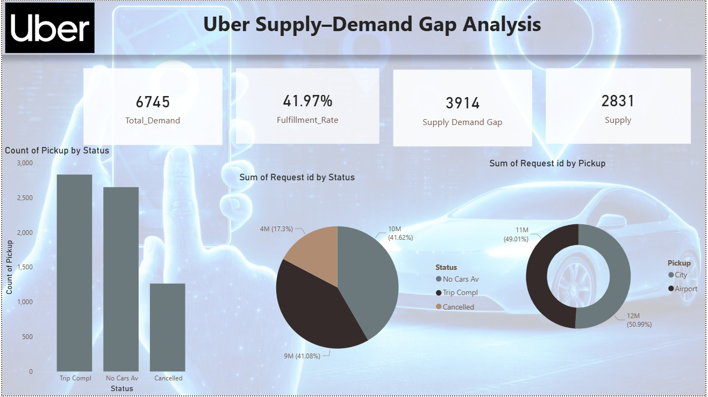

# Uber-Supply-Demand-Dashboard

🚖 Uber Supply-Demand Gap Analysis
📌 Problem Statement

# Ride-hailing platforms like Uber often face mismatch between customer demand and driver availability, leading to:

Ride cancellations
“No Cars Available” scenarios
Poor customer experience
Revenue loss

The goal of this project is to analyze demand vs supply gaps, identify patterns, and provide data-driven insights to improve ride fulfillment.

# 🎯 Objective
Analyze ride request data to identify supply-demand imbalance
Calculate Fulfillment Rate
Identify peak failure scenarios (No Cars / Cancellations)
Compare demand across pickup points (City vs Airport)
Provide actionable insights to reduce unmet demand

# 📊 Dataset Overview
Total Requests: 6745
Features:
Request ID
Pickup Point (City / Airport)
Status (Completed / Cancelled / No Cars Available)
Request Time

# 🛠️ Tech Stack
Python (Pandas, NumPy) – Data Cleaning & Analysis
SQL – Data Querying & Aggregations
Power BI / Tableau – Dashboard & Visualization
Excel – Initial Exploration

# ⚙️ Approach / Execution
1️⃣ Data Cleaning
Handled missing values
Standardized categorical values (Status, Pickup Point)
Converted timestamps into usable formats

# 2️⃣ Data Transformation
Created new features:
Time slots (Morning, Evening, Night)
Demand vs Supply metrics
Aggregated data using SQL & Pandas

# 3️⃣ KPI Calculation
Total Demand: 6745
Supply (Completed Trips): 2831
Supply-Demand Gap: 3914
Fulfillment Rate: 41.97%

# 4️⃣ Exploratory Data Analysis
Count of rides by status:
Completed
Cancelled
No Cars Available
Distribution of demand by:
Pickup Point (City vs Airport)
Status

# 5️⃣ Dashboard Development

Created an interactive dashboard showing:

KPI Cards (Demand, Supply, Gap, Fulfillment Rate)
Bar Chart → Status-wise ride distribution
Pie Chart → Request status distribution
Donut Chart → Pickup location analysis
📈 Key Insights
🚨 Low Fulfillment Rate (41.97%) → Major operational inefficiency
🚗 High number of “No Cars Available” → Supply shortage during peak hours
❌ Significant ride cancellations → Possible driver-side issues
✈️ Demand differs across:
Airport vs City
Peak time analysis shows uneven driver distribution

# 💡 Business Recommendations
Increase driver availability during peak hours
Use dynamic pricing / incentives to attract drivers
Improve driver allocation algorithms
Reduce cancellations by:
Better matching system
Driver accountability

# 📊 Project Outcome

Problem → Execution → Result

Problem: High mismatch between demand and supply leading to low fulfillment
Execution: Analyzed 6,700+ ride records using SQL, Python & Power BI to identify demand patterns and failure points
Result: Identified a 3914 ride gap and 41.97% fulfillment rate, highlighting critical areas for improving driver allocation and reducing cancellations

Uber_Supply_Demand.png
## 📸 Dashboard Preview

